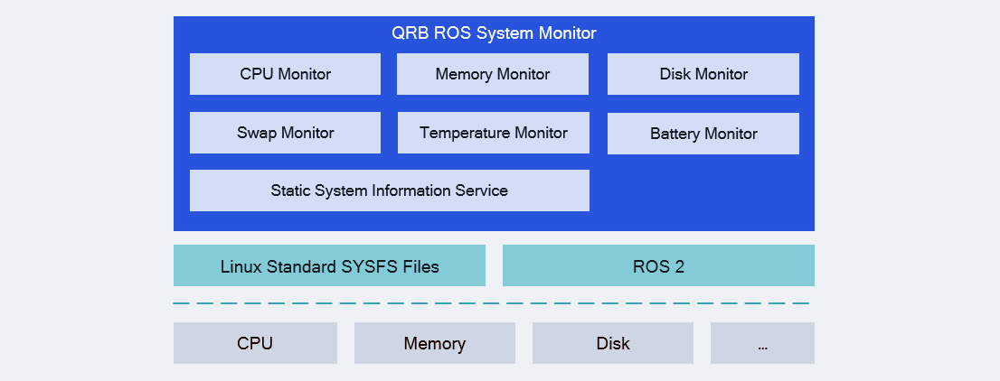

<div align="center">
  <h1>QRB ROS System Monitor</h1>
  <p align="center">
  </p>
  <p>ROS Packages for providing system informations for robotics system</p>

  <a href="https://ubuntu.com/download/qualcomm-iot" target="_blank"></a>
  <a href="https://docs.ros.org/en/jazzy/" target="_blank"></a>

</div>

---

## 👋 Overview

The [QRB ROS System Monitor](https://github.com/qualcomm-qrb-ros/qrb_ros_system_monitor) is a ROS package to privide system informations for robotics. It provides:

- CPU monitor: publish topic for CPU usage informations
- Memory monitor: publish topic for memory usage informations
- Disk monitor: publish topic for disk usage informations
- Swap monitor: publish topic for swap partition informations
- Temperature monitor: publish topic for CPU temperature
- Battery monitor: publish topic for device battery level
- Static system information server: Service for providing system informations.

<br>

<div align="center">
  
</div>

<br>

QRB ROS system monitors includes various ROS 2 nodes to publish informations with ROS messages. The ROS nodes access system status by reading Linux sysfs nodes, such as `/proc/cpuinfo`, `/proc/meminfo` etcs. 

## 🔎 Table of contents
  * [APIs](#-apis)
  * [Supported targets](#-supported-targets)
  * [Installation](#-installation)
  * [Usage](#-usage)
  * [Build from source](#-build-from-source)
  * [Contributing](#-contributing)
  * [Contributors](#%EF%B8%8F-contributors)
  * [License](#-license)

## ⚓ APIs

### 🔹 `qrb_ros_system_monitor` APIs

#### ROS interfaces

<table>
  <tr>
    <th>Interface</th>
    <th>Name</th>
    <th>Type</th>
    <td>Description</td>
  </tr>
  <tr>
    <td>Publisher</td>
    <td>/cpu</td>
    <td>qrb_ros_system_monitor::msg::CpuInfo</td>
    <td>output cpu usage information</td>
  </tr>
  <tr>
    <td></td>
    <td>/memory</td>
    <td>qrb_ros_system_monitor::msg::MemoryInfo</td>
    <td>output memory usage information</td>
  </tr>
  <tr>
    <td></td>
    <td>/disk</td>
    <td>qrb_ros_system_monitor::msg::DiskInfo</td>
    <td>output disk usage information</td>
  </tr>
  <tr>
    <td></td>
    <td>/swap</td>
    <td>qrb_ros_system_monitor::msg::SwapInfo</td>
    <td>output swap usage information</td>
  </tr>
  <tr>
    <td></td>
    <td>/temperature</td>
    <td>std_msgs::msg::Float32</td>
    <td>output CPU temperature</td>
  </tr>
  <tr>
    <td></td>
    <td>/battery</td>
    <td>std_msgs::msg::Float32</td>
    <td>output battery capability</td>
  </tr>
  <tr>
    <td>Service</td>
    <td>/system_info_server</td>
    <td>qrb_ros_system_monitor::srv::SystemInfo</td>
    <td>query static system information</td>
  </tr>
</table>

#### ROS parameters

<table>
  <tr>
    <th>Name</th>
    <th>Type</th>
    <th>Description</td>
    <th>Default Value</td>
  </tr>
  <tr>
    <td>interval</td>
    <td>int32</td>
    <td>The interval of message publish (s)</td>
    <td>5</td>
  </tr>

</table>

## 🎯 Supported targets

<table >
  <tr>
    <th>Development Hardware</th>
    <td>Qualcomm Dragonwing™ RB3 Gen2</td>
    <td>Qualcomm Dragonwing™ IQ-9075 EVK</td>
  </tr>
  <tr>
    <th>Hardware Overview</th>
    <th><a href="https://www.qualcomm.com/developer/hardware/rb3-gen-2-development-kit"></a></th>
    <th><a href="https://www.qualcomm.com/products/internet-of-things/industrial-processors/iq9-series/iq-9075"></a></th>
  </tr>
</table>

---

## ✨ Installation

> [!IMPORTANT]
> **PREREQUISITES**: The following steps need to be run on **Qualcomm Ubuntu** and **ROS Jazzy**.<br>
> Reference [Install Ubuntu on Qualcomm IoT Platforms](https://ubuntu.com/download/qualcomm-iot) and [Install ROS Jazzy](https://docs.ros.org/en/jazzy/index.html) to setup environment. <br>
> For Qualcomm Linux, please check out the [Qualcomm Intelligent Robotics Product SDK](https://docs.qualcomm.com/bundle/publicresource/topics/80-70018-265/introduction_1.html?vproduct=1601111740013072&version=1.4&facet=Qualcomm%20Intelligent%20Robotics%20Product%20(QIRP)%20SDK) documents.

Add Qualcomm IOT PPA for Ubuntu:

```bash
sudo add-apt-repository ppa:ubuntu-qcom-iot/qcom-noble-ppa
sudo add-apt-repository ppa:ubuntu-qcom-iot/qirp
sudo apt update
```

Install Debian package:

```bash
sudo apt install ros-jazzy-qrb-ros-system-monitor
```

## 🚀 Usage

### Start the system_monitor node

```bash
source /opt/ros/jazzy/setup.bash
ros2 run qrb_ros_system_monitor qrb_ros_system_monitor
```

These commands will start all system monitor ROS nodes. The output for these commands:

```bash
root@kalama:~/ros_ws# ros2 run qrb_ros_system_monitor qrb_ros_system_monitor
[INFO] [1754041095.755470762] [cpu_monitor]: CPU Monitor start
[INFO] [1754041095.775654235] [memory_monitor]: Memory Monitor start
[INFO] [1754041095.783700187] [temperature_monitor]: Temperature Monitor start
[INFO] [1754041095.791240297] [disk_monitor]: DISK Monitor start
[INFO] [1754041095.798755668] [swap_monitor]: Swap Monitor start
[INFO] [1754041095.804467314] [battery_monitor]: Battery Monitor start
[INFO] [1754041095.809501190] [system_info_server]: System info server start
...
```

Then you can check ROS topics with `ros2 topic list`.

```bash
/battery
/cpu
/disk
/memory
/parameter_events
/rosout
/swap
/temperature
```

This is the output for `/cpu` topic:
```
usage: 8.870357513427734
user: 2263131
nice: 17852
system: 12022972
idle: 3165299899
iowait: 235972
irq: 11140524
softirq: 4153651
steal: 294225
guest: 0
guest_nice: 0
---
```

### Use single monitor node only

The `qrb_ros_system_monitor` supports use single monitor node as `ComposableNode`:

```python
def generate_launch_description():
    container = ComposableNodeContainer(
        name='my_container',
        namespace='',
        package='rclcpp_components',
        executable='component_container',
        composable_node_descriptions=[
            ComposableNode(
                package='qrb_ros_system_monitor',
                plugin='qrb_ros_system_monitor::CpuMonitor',
                name='cpu_monitor',
            ),
            # ... other node
        ],
        output='screen',
    )

    return launch.LaunchDescription([container])
```

---

## 👨‍💻 Build from source

Download the source code and build with colcon
```bash
source /opt/ros/jazzy/setup.bash
git clone https://github.com/qualcomm-qrb-ros/qrb_ros_system_monitor.git
colcon build
```

Run and debug

```bash
source install/setup.bash
ros2 run qrb_ros_system_monitor qrb_ros_system_monitor
```

## 🤝 Contributing

We love community contributions! Get started by reading our [CONTRIBUTING.md](CONTRIBUTING.md).<br>
Feel free to create an issue for bug report, feature requests or any discussion💡.

## ❤️ Contributors

Thanks to all our contributors who have helped make this project better!

<table>
  <tr>
    <td align="center"><a href="https://github.com/penww"><br /><sub><b>penww</b></sub></a></td>
    <td align="center"><a href="https://github.com/jiaxshi"><br /><sub><b>jiaxshi</b></sub></a></td>
    <td align="center"><a href="https://github.com/quic-zhaoyuan"><br /><sub><b>quic-zhaoyuan</b></sub></a></td>
  </tr>
</table>

## 📜 License

Project is licensed under the [BSD-3-Clause](https://spdx.org/licenses/BSD-3-Clause.html) License. See [LICENSE](./LICENSE) for the full license text.
